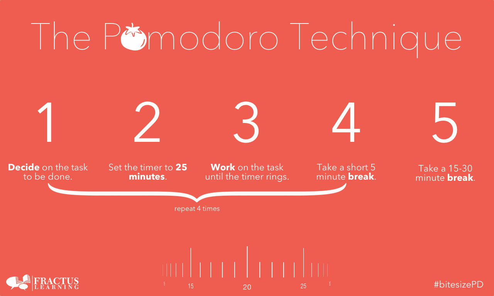

# pomomethod
<a href="/pomodoromethod/app/">Use the web version</a>
pomodoro method using coundown timers with electron

<h1>What is the Pomomethod?</h1>
The Pomodoro Technique is created by Francesco Cirillo for a more productive way to work and study. The technique uses a timer to break down work into intervals, traditionally 25 minutes in length, separated by short breaks. Each interval is known as a pomodoro, from the Italian word for 'tomato', after the tomato-shaped kitchen timer that Cirillo used as a university student

Usage:

click on star button and the app start counting time and minimize to tray while you do your activities

this app will not count the pomodoro if u stop while rest or pomo time isn't finished

__Very important the app is only packaged for Windows if u want package for other sys u can follow the next steps__

Donwloads:
<a href="https://mega.nz/file/0VVA2AyR#kAVaN_qtblI8W1f_MNWx6ze5NpmCK8ByxDh4vegOgLA">WINX64</a>

Requeriments for packaging
<ul>
<li>node js</li>
<li>npm</li>
<li>electron</li>
<li>yarn</li>
</ul>

Features
<ul>
<li>Color transition to switch moods between work time and rest time</li>
<li>notification at the end of a timer period</li>
</ul>
#pomométodo
método pomodoro usando temporizadores de cuenta regresiva con electrones

<h1>¿Qué es el Pomométodo?</h1>
La Técnica Pomodoro es creada por Francesco Cirillo para una forma más productiva de trabajar y estudiar. La técnica utiliza un temporizador para dividir el trabajo en intervalos, tradicionalmente de 25 minutos de duración, separados por breves descansos. Cada intervalo se conoce como pomodoro, de la palabra italiana para 'tomate', en honor al reloj de cocina con forma de tomate que Cirillo usaba cuando era estudiante universitario.

Uso:

haga clic en el botón de estrella y la aplicación comenzará a contar el tiempo y minimizará a la bandeja mientras realiza sus actividades

esta aplicación no contará el pomodoro si te detienes mientras el tiempo de descanso o pomo no ha terminado

__Muy importante, la aplicación solo está empaquetada para Windows si desea un paquete para otros sistemas, puede seguir los siguientes pasos__

Descargas:
<a href="https://mega.nz/file/0VVA2AyR#kAVaN_qtblI8W1f_MNWx6ze5NpmCK8ByxDh4vegOgLA">WINX64</a>
<a href="/pomodoromethod/app/">Usar la  version web </a>

Requisitos para el embalaje
<ul>
<li>node js</li>
<li>npm</li>
<li>electrón</li>
<li>yarn</li>
</ul>

Caracteristicas
<ul>
<li>Transición de color para cambiar de estado de ánimo entre el tiempo de trabajo y el tiempo de descanso</li>
<li>notificación al final de un período de tiempo</li>
</ul>
